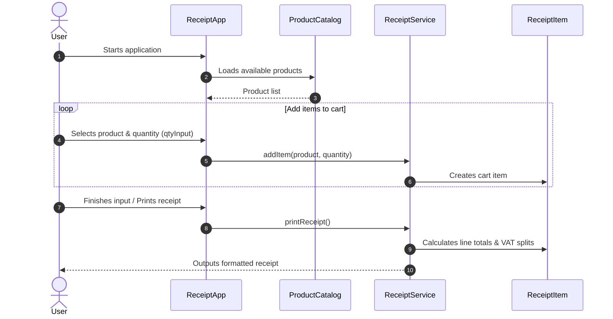

# Receipt Generator

A Java CLI application that calculates VAT, itemized totals, and prints formatted receipts in the terminal.

## Overview & Goals

This project demonstrates Object-Oriented Design (OOD) principles in Java by building a modular command-line receipt generator. The main objective is to enforce a strict separation of concerns between domain data, business logic, and terminal presentation.

## Architecture & Design Decisions

1. **Data-Driven Modeling (TaxCategory & Product)**
   - **TaxCategory (Enum):** Encapsulates tax logic and rates (7%, 19%) rather than using hardcoded floating-point constants. Provides type safety and extensibility.
   - **Product (Class):** Pure domain entity representing item state with private fields and getter methods.

2. **Data Access & Catalog (ProductCatalog)**
   - **ProductCatalog (Class):** Acts as an in-memory data repository layer managing available store products.

3. **Separation of Concerns & Services**
   - **ReceiptItem (Class):** Represents a cart position combining a product and its quantity (`qtyInput`).
   - **ReceiptService (Class):** Encapsulates business logic (calculating subtotals, VAT amounts, and itemized totals).
   - **ReceiptApp (Class):** CLI entry point responsible purely for user input via `Scanner` and console rendering.

4. **Product Catalog / Sample Data**
   - Apple: 0.99 € (REDUCED / 7%)
   - Milk: 1.49 € (REDUCED / 7%)
   - Cola: 2.49 € (STANDARD / 19%)

## Program Flow


## Concepts & Exam Topics Practiced (Java Foundations)

Type Safety & Enums: Working with fixed value sets and constants.

Encapsulation: Private field scope with getter methods.

Arithmetic & Primitive Types: Precise calculation handling with Java primitive types.

Collections: Managing items via List and ArrayList.

## Project Structure

```text
01-receipt-generator/
├── README.md
└── src/
    └── receipt/
        ├── TaxCategory.java  # Enum for tax rates (7%, 19%)
        ├── Product.java # Data model for items
        ├── ProductCatalog.java  # Predefined product database
        ├── ReceiptItem.java     # Cart item (product + quantity)
        ├── ReceiptService.java  # Business logic & receipt formatting
        └── ReceiptApp.java      # CLI entry point (Main)
```

## Setup & Execution

### Prerequisites

* JDK 17 or higher

### Build & Run Commands

1. Compile all Java source files into the binary directory:

   
```bash
   javac -d bin src/receipt/*.java
   
```

2. Run the application entry point:

   
```bash
   java -cp bin receipt.ReceiptApp
   
```

## Development Workflow
* This project adheres to Conventional Commits to track architectural milestones clearly.