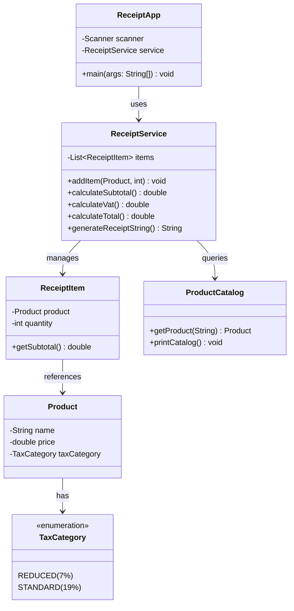
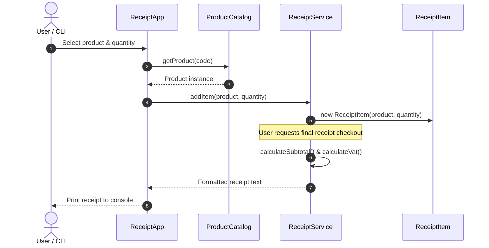

# Receipt Generator (Java CLI)

A command-line receipt and tax calculator built in pure Java. Handles itemized shopping carts, tax categorization, and formatted terminal output.

## Features

* **Product Catalog:** Predefined store products with pricing and tax categories.
* **Cart Management:** Add multiple products with custom quantities.
* **Precise Tax Calculations:** Automatic breakdown of reduced (7%) and standard (19%) VAT rates.
* **Formatted Output:** Clean terminal-rendered receipt printing.

## Architecture & Diagrams

### 1. Class Diagram (Static Structure)



### 2. Sequence Diagram (Item Addition & Calculation Flow)



## Setup & Execution

### Prerequisites
- JDK 17 or higher

### Build & Run Commands
Make sure you are in the project root directory, then compile and run:

```bash
# Step 1: Compile all Java source files into the binary directory
javac -d bin src/receipt/*.java

# Step 2: Run the application entry point
java -cp bin receipt.ReceiptApp
