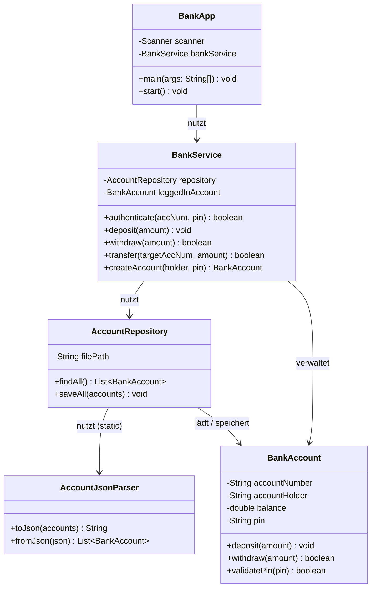

## Architektur & Klassendiagramm

```mermaid
classDiagram
    class BankApp {
        -Scanner scanner
        -BankService bankService
        +main(args: String[]) void
        +start() void
    }

    class BankService {
        -AccountRepository repository
        -BankAccount loggedInAccount
        +authenticate(accNum, pin) boolean
        +deposit(amount) void
        +withdraw(amount) boolean
        +transfer(targetAccNum, amount) boolean
        +createAccount(holder, pin) BankAccount
    }

    class AccountRepository {
        -String filePath
        +findAll() List~BankAccount~
        +saveAll(accounts) void
    }

    class AccountJsonParser {
        +toJson(accounts) String
        +fromJson(json) List~BankAccount~
    }

    class BankAccount {
        -String accountNumber
        -String accountHolder
        -double balance
        -String pin
        +deposit(amount) void
        +withdraw(amount) boolean
        +validatePin(pin) boolean
    }

    BankApp --> BankService : nutzt
    BankService --> AccountRepository : nutzt
    BankService --> BankAccount : verwaltet
    AccountRepository --> AccountJsonParser : nutzt (static)
    AccountRepository --> BankAccount : lädt / speichert
```