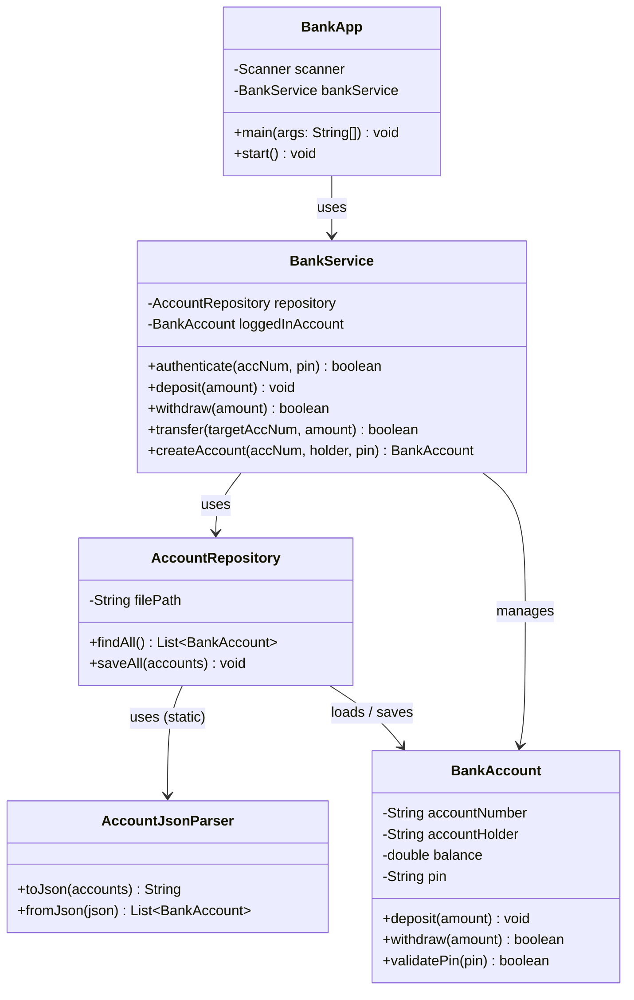
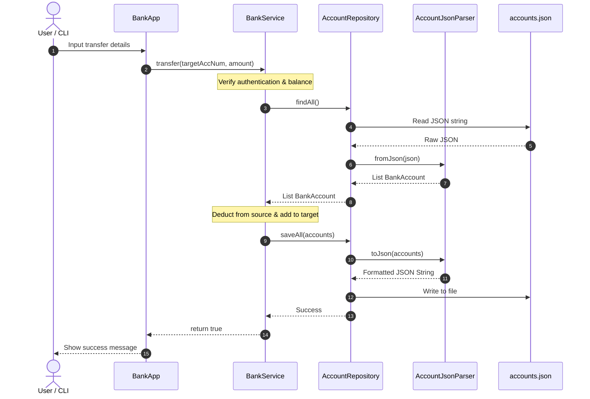

# Banking Account Management System (Java CLI)

An object-oriented banking system built in pure Java featuring custom regex-based JSON persistence, PIN authentication, and an automated build script.

---

## Features

* **Account Management:** Create bank accounts with custom account numbers, account holders, and initial PINs.
* **Security:** PIN authentication required for account access and transactions.
* **Transactions:** Deposits, withdrawals (with overdraft protection), and transfers between accounts.
* **File Persistence:** Saves and loads state via `data/accounts.json` without external third-party dependencies.
* **Build Automation:** One-click automated clean build and execution via a Windows Batch script (`start.bat`).

---

## Architecture & Diagrams

The application follows a clean layered architecture (Separation of Concerns) and Domain-Driven Design principles ("Core First").

### 1. Class Diagram (Static Structure)

---

### 2. Sequence Diagram (Dynamic Transfer Flow)

